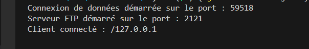

# Documentation du Serveur FTP

## 1. Introduction

Cette documentation présente une démonstration du fonctionnement d'un serveur FTP . Le serveur FTP permet une connexion avec un login et un mot de passe, et permet aux utilisateurs d'utiliser des commandes telles que `QUIT`, `GET`, `DIR`, et `CD`.

## 2. Fonctionnement du Serveur

### 2.1. Connexion initiale

Lorsque l'utilisateur se connecte au serveur FTP, il reçoit un message d'accueil, puis il peut saisir son nom d'utilisateur.

### 2.2. Authentification

Après avoir saisi le nom d'utilisateur, l'utilisateur doit entrer son mot de passe. Si l'authentification réussit, il est connecté et peut utiliser les commandes FTP.

### 2.3. Commande `QUIT` pour la déconnexion

L'utilisateur peut se déconnecter en envoyant la commande `QUIT`. Le serveur répondra par un message de déconnexion.

### 2.4. Commande `GET`

Pour permettre à un utilisateur de télécharger un fichier, le serveur doit ouvrir une connexion de données et envoyer le fichier demandé.

### 2.5. Commande `DIR`

La commande `DIR` permet d'afficher la liste des fichiers dans le répertoire courant. Le serveur doit répondre en envoyant les noms de fichiers et de dossiers via la connexion de données.

### 2.6. Commande `CD`

La commande `CD` permet à l'utilisateur de changer de répertoire. Le serveur doit vérifier si le répertoire existe et, si c'est le cas, changer le répertoire courant.

